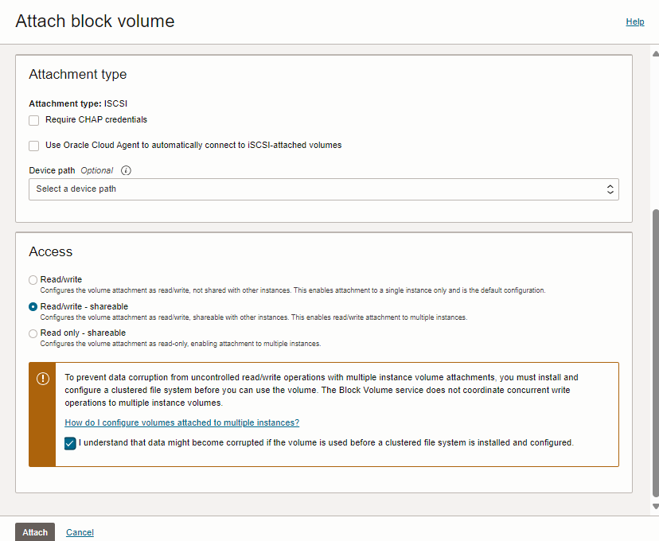
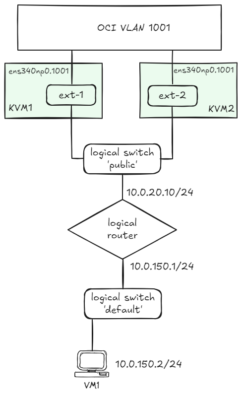

# How to Deploy Oracle Linux Virtualization Manager(OLVM) on Oracle Cloud Infrastructure


**This document is for test and educational purposes only.**

**OLVM is not supported to run in OCI.**

## Introduction

One of our customers was looking for a solution to increase the utilization of a fleet of Bare Metal nodes. Considering they were using OLVM on-premise, they asked for a similar solution in OCI. Integration of OLVM with the OCI Networking was challenging but eventually we were able to integrate OVN and OCI networking and provide connectivity between on-premise resources and the OLVM created VMs in OCI via fast-connect.

The purpose of this document is to demonstrate how to run Oracle Linux Virtualization Manager (OLVM) 4.5 in OCI, and enable VM Internet access via OCI NAT Gateway. 

## Prerequisites

- OLVM hosted engine can run on a Virtual Machine (VM) (VM.Standard.E5.Flex with 2 OCPUs/24GB RAM - tested).
- OL-KVM hosts can run on Bare Metal (BM) hosts (BM.Standard.E5.192 - tested).
- All the BM resources should be created in the same Availability Domain (AD).
- All hosts can run Oracle Linux 8 (Oracle-Linux-8.10-2024.09.30-0 - tested).

## Solution Overview

We will need a new VCN with two subnets:
- one public, 10.0.11.0/24 - used for the primary VNIC of the hosted-engine.
- one private, 10.0.12.0/24 - used for the primary VNIC of the KVM hosts.
- VLAN 1000, 10.0.10.0/24 - used for the communication between OLVM hosted-engine and KVM hosts.
- VLAN 1001, 10.0.20.0/24 - used to expand the OVN virtual networks into OCI.
- one NAT Gateway.
- one Internet Gateway.
- one private route table (0.0.0.0/0 via NAT GW) and associate it with the private subnet and VLAN 1001.
- one public route table (0.0.0.0/0 via Internet GW) and associate it with the public subnet.
- security lists should allow:
    - all egress connections (0.0.0.0/0) - all protocols
    - all ingress connections from VCN CIDR (10.0.0.0/16)
    - ingress connection for all protocols from client PC


## Solution deployment

Create one VM instance (recommended configuration: VM.Standard.E5.Flex with 2 OCPUs/24GB RAM) running Oracle Linux 8 for the Hosted Engine. Attach a secondary VNIC to the VM instance and connect it to the VLAN 1000.

Create two BM instances (recommended configuration: BM.Standard.E5.192) running Oracle Linux 8 that will be used as KVM hosts. Attach two secondary VNICs to each of the BM hosts and connect them to the VLANs 1000 and 1001.


### Setup OLVM Hosted-Engine

We will start by configuring the secondary interface. The current interface status should be:


    [root@olvm-he opc]# ifconfig
    enp0s5: flags=4163<UP,BROADCAST,RUNNING,MULTICAST>  mtu 9000
            inet 10.0.11.189  netmask 255.255.255.0  broadcast 10.0.11.255
            inet6 fe80::17ff:fe10:3ae0  prefixlen 64  scopeid 0x20<link>
            ether 02:00:17:10:3a:e0  txqueuelen 1000  (Ethernet)
            RX packets 10199  bytes 176890375 (168.6 MiB)
            RX errors 0  dropped 0  overruns 0  frame 0
            TX packets 6954  bytes 1777090 (1.6 MiB)
            TX errors 0  dropped 0 overruns 0  carrier 0  collisions 0

    enp1s0: flags=4163<UP,BROADCAST,RUNNING,MULTICAST>  mtu 1500
            ether 02:00:17:11:02:0c  txqueuelen 1000  (Ethernet)
            RX packets 19  bytes 6498 (6.3 KiB)
            RX errors 0  dropped 0  overruns 0  frame 0
            TX packets 166  bytes 28164 (27.5 KiB)
            TX errors 0  dropped 0 overruns 0  carrier 0  collisions 0

    lo: flags=73<UP,LOOPBACK,RUNNING>  mtu 65536
            inet 127.0.0.1  netmask 255.0.0.0
            inet6 ::1  prefixlen 128  scopeid 0x10<host>
            loop  txqueuelen 1000  (Local Loopback)
            RX packets 80  bytes 6320 (6.1 KiB)
            RX errors 0  dropped 0  overruns 0  frame 0
            TX packets 80  bytes 6320 (6.1 KiB)
            TX errors 0  dropped 0 overruns 0  carrier 0  collisions 0

Configure the second interface, enp1s0, in VLAN 1000:

```
[root@olvm-he opc]# nmcli connection add type ethernet con-name enp1s0 ifname enp1s0 ipv4.method manual ipv4.address '10.0.10.5/24' ipv4.gateway '10.0.10.1'
```

Next, we will install Oracle Linux Virtualization Manager(OLVM) Release 4.5.

1. Enable the `ol8_baseos_latest` repository.

    ```
    [root@olvm-he opc]# dnf config-manager --enable ol8_baseos_latest
    ```

2. Install the Oracle Linux Virtualization Manager Release 4.5 package, which automatically enables/disables the required repositories.

    ```
    [root@olvm-he opc]# dnf install -y oracle-ovirt-release-45-el8
    ```

3. Use the `dnf` command to verify that the required repositories are enabled.

    ```
    [root@olvm-he opc]# dnf clean all
    [root@olvm-he opc]# dnf repolist
    ```

    The following repositories must be enabled:

    * ol8_baseos_latest
    * ol8_appstream
    * ol8_kvm_appstream
    * ovirt-4.5
    * ovirt-4.5-extra
    * ol8_gluster_appstream
    * (For VDSM) ol8_UEKR7

    Enable any missing repository with the command:

    ```
    [root@olvm-he opc]# dnf config-manager --enable <repository-name> 
    ```

4. If your host is running UEK R7

    ```
    dnf install -y kernel-uek-modules-extra
    ```    

    Reboot the VM.

5. Install the Manager using the ovirt-engine command:

    ```
    dnf install -y ovirt-engine --allowerasing
    ```

7. Configure the engine with the command:
    
    ```
    engine-setup
    ```

    For each configuration step, you may check the recommendations on the [official installation documentation](https://docs.oracle.com/en/virtualization/oracle-linux-virtualization-manager/getstart/getstarted-manager-install.html#manager-config-options).

### Access the OLVM web console

If the installation was successful, you should see the Web access information being displayed in the console:

    ...
    http://olvm-he.olvm.defaultvcn.oraclevcn.com:80/ovirt-engine
    https://olvm-he.olvm.defaultvcn.oraclevcn.com:443/ovirt-engine.
    ...

**Notes:**  
- By default, the Oracle VCN domain is not publicly resolvable.
- Make sure the Security List/NSG configured for the instance allows ingress connections on port 443.

To access the OLVM Hosted Engine web console, you can add a DNS record to the local OS hosts file (C:\Windows\System32\drivers\etc\hosts - Windows):

```
<VM-public-IP> olvm-he.olvm.defaultvcn.oraclevcn.com
```

You can authenticate with `admin@ovirt` username and the configured password.


### Setup the KVM Hosts

We are starting with the first KVM host. To configure the second host, you need to ssh into the second BM host and execute the same commands. Note to update the MAC and IP addresses when you setup the VLAN 1000 interface.

1. Confirm the KVM host has two secondary VNICs, connected to VLAN 1000 and 1001:


2. Setup secondary VNIC in VLAN1000:

    ```
    [root@kvm-1 opc]# nmcli connection add type vlan con-name ens340np0.1000 ifname ens340np0.1000 vlan.parent ens340np0 vlan.id 1000
    [root@kvm-1 opc]# nmcli connection modify ens340np0.1000 ethernet.cloned-mac-address 02:00:17:14:AA:20 ipv4.addresses '10.0.10.11/24' ipv4.gateway '10.0.10.1' ipv4.method manual
    ```

**Note:** 
- `02:00:17:14:AA:20` is the MAC address of the VLAN 1000 VNIC for the first KVM Host (make sure to use the correct MAC address when you setup the interface ens340np0.1000 on the second KVM host)
- `10.0.10.11/24` is the IP address we will use for the first KVM Host in VLAN 1000
- `10.0.10.12/24` is the IP address we will use for the second KVM Host in VLAN 1000

3. Enable the `ol8_baseos_latest` repository.

    ```
    [root@kvm-1 opc]# dnf config-manager --enable ol8_baseos_latest
    ```

4. Install the Oracle Linux Virtualization Manager Release 4.5 package, which automatically enables/disables the required repositories.

    ```
    [root@kvm-1 opc]# dnf install -y oracle-ovirt-release-45-el8
    ```

5. Use the `dnf` command to verify that the required repositories are enabled.
    
    ```
    [root@kvm-1 opc]# dnf clean all
    [root@kvm-1 opc]# dnf repolist
    ```

    The following repositories must be enabled:

    * ol8_baseos_latest
    * ol8_appstream
    * ol8_kvm_appstream
    * ovirt-4.5
    * ovirt-4.5-extra
    * ol8_gluster_appstream
    * (For VDSM) ol8_UEKR7

    Enable any missing repository with the command:

    ```
    [root@kvm-1 opc]# dnf config-manager --enable <repository-name>
    ```

6. If your host is running UEK R7
    
    ```
    [root@kvm-1 opc]# dnf install -y kernel-uek-modules-extra
    ```

    Reboot the host

7. Activate the Cockpit web console and open the firewall port.

    ```
    [root@kvm-1 opc]# systemctl enable --now cockpit.socket
    [root@kvm-1 opc]# firewall-cmd --permanent --zone=public --add-service=cockpit
    [root@kvm-1 opc]# firewall-cmd --reload
    ```

### Setup the DNS private zone

Following [these instructions](https://docs.oracle.com/en-us/iaas/Content/DNS/Tasks/create-private-zone.htm), create a new private DNS zone in OCI.

- The zone can be named `olvm.demo`. 
- Attach the zone to the DNS private view of the VCN.

Create two DNS records for the two KVM hosts and publish the changes.

```
A 10.0.10.11 kvm1.olvm.demo
A 10.0.10.12 kvm2.olvm.demo
```


### Add the KVM hosts to OLVM.

1. Connect to the OVLM web console.

2. Update the `ovirtmgmt` network to use **VLAN 1000**.

    1. Navigate to *Networks* -> *Networks*.

    2. Select `ovirtmgmt` from the list and click `Edit`.
    
    3. Check `Enable VLAN tagging` box, fill-in `1000` and click `Ok`.

3. Add the KVM hosts.

    1. Navigate to *Compute* -> *Hosts*.
    2. Click `New` and fill-in the details:

        ```
        Name: kvm1.olvm.demo
        Hostname: kvm1.olvm.demo
        Authentication: SSH Public Key
        ```
        Add the public ssh key to the /root/.ssh/authorized_keys file on the KVM host   (remove the existing content).

    3. Click `Ok`.


### Add the OLVM CA to the browser trusted RCA list.

Download the CA certificate from the address: `https://<OLVM-hosted-engine-FQDN>/ovirt-engine/services/pki-resource?resource=ca-certificate&format=X509-PEM-CA`

Navigate to the browser `Settings` -> `Certificates` and import the OLVM CA to the Trusted Root Certificate Authorities list.

### Create a new Storage Domain.

1. Create a new Block Volume in OCI. (Create it within the same availability domain as the KVM hosts.)

    

2. Attach the new Block Volume to the first KVM host (select Read/write - shareable as Access Mode.)

    

3. Redo Step.2 and attach the same Block Volume to the second KVM host (select Read/Write - shareable as Access Mode).

4. Create a new Storage Domain in OLVM.

    Navigate to *Storage* -> *Domains*.

    Click `New Domain`.

    ```
    Name: iscsi-datavol
    Storage Type: iSCSI.
    Host: kvm1.private.zone
    Address: 169.254.2.2 Port: 3260
    ```
    
    Click `Login All`.

    Expand the discovered target and click `Add` for the LunID.
    
    Click `Ok` to create the new Domain.

### Upload a new OS image.

Navigate to *Storage* -> *Disks*.

Click `Upload` -> `Start`.

Provide the [OS ISO image](https://ubuntu.com/download/server). Select the `iscsi-datavol` storage domain and click `Ok`.


### Setup OVN Networking.

Navigate to *Network* -> *Networks*. Click `New`.

```
Name: Default
Check the "Create on external provider" box.
External Provider: ovirt-provider-ovn.
Network Port Security: Disabled.
```


Select *Subnets* from the left-side menu:

Create a new subnet: 

```
Name: default
CIDR: 10.0.150.0/24
Gateway: 10.0.150.1
```


Click `Ok`.

### Provision a new VM in OLVM.

We will create a VM in OLVM.

Navigate to *Compute* -> *Virtual Machines*.

Click `New`. 
```
Name: vm1
Instance Images -> Create
    Size: 15GB
    Click Ok

nic1: Default/Default
```

Click `Show Advanced Options`.

```
Boot Options: Attach CD - ubuntu-24.04.1-live-server-amd64.iso
```

Click `Ok`.


Wait for the disk to be created, select the created VM, click `Run` and wait for the VM to start

Connect to the VM console.

Navigate to *Console* -> *Console Options*.

Select *NoVNC* -> Click `Ok`.

Click `Console`.

Proceed installing the OS, note that at stage Internet is not available.

### Connect the OVN network to OCI VCN.

In the followin image you can see a illustration of the logical network we need to define in OLVM.



The access to the OCI VLAN 1001 is provided through a [distributed gateway port](https://developers.redhat.com/blog/2018/11/08/how-to-create-an-open-virtual-network-distributed-gateway-router#setup_details).

Configure the third VNICs on the KVM Hosts.

    nmcli connection add type vlan con-name ens340np0.1001 ifname ens340np0.1001 vlan.parent ens340np0 vlan.id 1001

    nmcli connection modify ens340np0.1001 ethernet.cloned-mac-address <VNIC-MAC> ipv4.method disabled ipv6.method disabled

    # replace the <VNIC-MAC> with the MAC address associated with the VNIC connected to VLAN 1001.


Execute the following commands from the OLVM engine.

Display the current setup:

    [root@olvm-he opc]# ovn-nbctl show
    switch 9364e7ce-87a9-4bc4-b044-b973e3288bcd (ovirt-Default-72198b26-61c3-4448-b13e-b72bb29f57ea)
        port 35bfefc5-8a7e-4f17-b508-587d764875ba
            addresses: ["56:6f:4b:b2:00:01 dynamic"]
    [root@olvm-he opc]# ovn-sbctl show
    Chassis kvm2.olvm.demo
        hostname: kvm-2.kvmhosts.defaultvcn.oraclevcn.com
        Encap geneve
            ip: "10.0.10.12"
            options: {csum="true"}
    Chassis kvm1.olvm.demo
        hostname: kvm-1.kvmhosts.defaultvcn.oraclevcn.com
        Encap geneve
            ip: "10.0.10.11"
            options: {csum="true"}
        Port_Binding "35bfefc5-8a7e-4f17-b508-587d764875ba"

Create the logical router, `router`.

    [root@olvm-he opc]# ovn-nbctl lr-add router

Create router port for connection to the OLVM `Default` bridge.

    [root@olvm-he opc]# ovn-nbctl lrp-add router router-ovirt-default 40:44:00:00:00:03 10.0.150.1/24

Connect the `Default` bridge to the router.

    [root@olvm-he opc]# ovn-nbctl lsp-add ovirt-Default-72198b26-61c3-4448-b13e-b72bb29f57ea ovirt-default-router
    [root@olvm-he opc]# ovn-nbctl lsp-set-type ovirt-default-router router
    [root@olvm-he opc]# ovn-nbctl lsp-set-addresses ovirt-default-router router
    [root@olvm-he opc]# ovn-nbctl lsp-set-options ovirt-default-router router-port=router-ovirt-default

Display the logical network:

    [root@olvm-he opc]# ovn-nbctl show
    switch 9364e7ce-87a9-4bc4-b044-b973e3288bcd (ovirt-Default-72198b26-61c3-4448-b13e-b72bb29f57ea)
        port ovirt-default-router
            type: router
            router-port: router-ovirt-default
        port 35bfefc5-8a7e-4f17-b508-587d764875ba
            addresses: ["56:6f:4b:b2:00:01 dynamic"]
    router b4bd08bc-d8c0-43c8-b27e-83e6e1f3b940 (router)
        port router-ovirt-default
            mac: "40:44:00:00:00:03"
            networks: ["10.0.150.1/24"]

Create the logical bridge `public`:

    [root@olvm-he opc]# ovn-nbctl ls-add public

Prepare to connect the local KVM hosts port to the logical bridge `public` via the `provider` network.

    [root@olvm-he opc]# ovn-nbctl lsp-add public ln-public
    [root@olvm-he opc]# ovn-nbctl lsp-set-type ln-public localnet
    [root@olvm-he opc]# ovn-nbctl lsp-set-addresses ln-public unknown
    [root@olvm-he opc]# ovn-nbctl lsp-set-options ln-public network_name=provider

Connect the `router` to the `public` logical bridges using a distributed router port.

    [root@olvm-he opc]# ovn-nbctl lrp-add router router-public 02:00:17:0F:D1:16 10.0.20.10/24
    [root@olvm-he opc]# ovn-nbctl lsp-add public public-router
    [root@olvm-he opc]# ovn-nbctl lsp-set-type public-router router
    [root@olvm-he opc]# ovn-nbctl lsp-set-addresses public-router router
    [root@olvm-he opc]# ovn-nbctl lsp-set-options public-router router-port=router-public

Schedule the router port (higher priority for the first KVM host)

    [root@olvm-he opc]# ovn-nbctl lrp-set-gateway-chassis router-public kvm1.olvm.demo 20
    [root@olvm-he opc]# ovn-nbctl lrp-set-gateway-chassis router-public kvm2.olvm.demo 15

Check the configuration of the router port:

    [root@olvm-he opc]# ovn-nbctl lrp-get-gateway-chassis router-public
    router-public-kvm1.olvm.demo    20
    router-public-kvm2.olvm.demo    15

Define next hop for `0.0.0.0/0` via OCI VLAN gateway.

    [root@olvm-he opc]# ovn-nbctl lr-route-add router "0.0.0.0/0" 10.0.20.1

Configuration summary:

    [root@olvm-he opc]# ovn-nbctl show
    switch a7ce3f64-44e2-4a60-993b-b2d230a13212 (public)
        port public-router
            type: router
            router-port: router-public
        port ln-public
            type: localnet
            addresses: ["unknown"]
    switch 9364e7ce-87a9-4bc4-b044-b973e3288bcd (ovirt-Default-72198b26-61c3-4448-b13e-b72bb29f57ea)
        port ovirt-default-router
            type: router
            router-port: router-ovirt-default
        port 35bfefc5-8a7e-4f17-b508-587d764875ba
            addresses: ["56:6f:4b:b2:00:01 dynamic"]
    router b4bd08bc-d8c0-43c8-b27e-83e6e1f3b940 (router)
        port router-ovirt-default
            mac: "40:44:00:00:00:03"
            networks: ["10.0.150.1/24"]
        port router-public
            mac: "02:00:17:0F:D1:16"
            networks: ["10.0.20.10/24"]
            gateway chassis: [kvm1.olvm.demo kvm2.olvm.demo]
    [root@olvm-he opc]# ovn-sbctl show
    Chassis kvm2.olvm.demo
        hostname: kvm-2.kvmhosts.defaultvcn.oraclevcn.com
        Encap geneve
            ip: "10.0.10.12"
            options: {csum="true"}
    Chassis kvm1.olvm.demo
        hostname: kvm-1.kvmhosts.defaultvcn.oraclevcn.com
        Encap geneve
            ip: "10.0.10.11"
            options: {csum="true"}
        Port_Binding cr-router-public
        Port_Binding "35bfefc5-8a7e-4f17-b508-587d764875ba"


We can confirm by seeing `Port_Binding cr-router-public` under `kvm1.olvm.demo` that the router port is associated with the first KVM host.

Map local interfaces of the KVM hosts, connected to VLAN 1001, to the `provider` network.

    [root@kvm-1 opc]# ovs-vsctl set open . external-ids:ovn-cms-options="enable-chassis-as-gw=true"
    [root@kvm-1 opc]# ovs-vsctl set open . external-ids:ovn-bridge-mappings=provider:br-provider
    [root@kvm-1 opc]# ovs-vsctl --may-exist add-br br-provider
    [root@kvm-1 opc]# ovs-vsctl --may-exist add-port br-provider ens340np0.1001
    [root@kvm-1 opc]# ovs-vsctl set open . external-ids:ovn-chassis-mac-mappings=br-provider:02:00:17:0F:D1:16

    [root@kvm-2 opc]# ovs-vsctl set open . external-ids:ovn-cms-options="enable-chassis-as-gw=true"
    [root@kvm-2 opc]# ovs-vsctl set open . external-ids:ovn-bridge-mappings=provider:br-provider
    [root@kvm-2 opc]# ovs-vsctl --may-exist add-br br-provider
    [root@kvm-2 opc]# ovs-vsctl --may-exist add-port br-provider ens340np0.1001
    [root@kvm-2 opc]# ovs-vsctl set open . external-ids:ovn-chassis-mac-mappings=br-provider:02:00:17:08:08:A5

The OCI VLAN is deliverying frames only to the MAC addresses associated with the VLAN connected devices.

If we are not using NAT, in the event the owner of the logical router port is changed, we need to update the Logical Router Port MAC address to match the MAC address of the active chassis.  

The service below takes care of this operation.

Update the OVN SB database with the chassis MAC address mappings (required for the switchover controller functionality.)

    [root@olvm-he opc]# ovn-sbctl set chassis kvm1.olvm.demo external_ids:ovn-chassis-mac-mappings=br-provider:02:00:17:0F:D1:16 #replace with the MAC address of the VLAN1001 VNIC on KVM1 host
    [root@olvm-he opc]# ovn-sbctl set chassis kvm2.olvm.demo external_ids:ovn-chassis-mac-mappings=br-provider:02:00:17:08:08:A5 #replace with the MAC address of the the VLAN1001 VNIC on KVM2 host

Create the file `/usr/share/ovirt-provider-ovn/ovn_ha_gw_controller.py` with the following content:

    import logging
    import os
    import sys
    import traceback

    from ovsdbapp.backend.ovs_idl import connection
    from ovsdbapp.backend.ovs_idl import idlutils
    from ovsdbapp.schema.ovn_southbound import impl_idl as impl_sbidl
    from ovsdbapp.schema.ovn_northbound import impl_idl as impl_nbidl
    from ovsdbapp.backend.ovs_idl import event as row_event
    from threading import Event


    stdout_handler = logging.StreamHandler(stream=sys.stdout)

    logging.basicConfig(
        level=logging.INFO, 
        format='%(processName)s %(threadName)s:	%(asctime)s - %(name)s - %(module)s - %(levelname)s - %(message)s',
        handlers = [stdout_handler]
    )

    logger = logging.getLogger('main')


    OVN_MONITORED_LOGICAL_PORT = os.environ.get('OVN_MONITORED_LOGICAL_PORT', '')

    if not OVN_MONITORED_LOGICAL_PORT:
        logger.info("No distributed router port name found. Check if the `OVN_MONITORED_LOGICAL_PORT` is defined.")
        sys.exit(1)

    conn_sb = "unix:/var/run/ovn/ovnsb_db.sock"
    conn_nb = "unix:/var/run/ovn/ovnnb_db.sock"

    class PortBindingEvent(row_event.RowEvent):
        """
        Port_Binding event
        """

        def __init__(self, monitored_logical_port):
            table = 'Port_Binding'
            self.monitored_logical_port = monitored_logical_port
            events = (self.ROW_UPDATE)
            super().__init__(events, table, None)
            self.event_name = self.__class__.__name__

        def match_fn(self, event, row, old):
            try:
                # Check if the event is for the distributed gateway port.
                if row.logical_port != self.monitored_logical_port:
                    return False

                # Check if chassis data is present and the chassis field was modified.
                logger.debug(f"Event match_fn with row: {row.__repr__} | old: {old.__dict__}")
                if len(row.chassis) and old._data.get("chassis", None):
                    logger.info(f"The monitored router port has been allocated to a new chassis: {row.chassis[0].name}")
                    return True

            except Exception as e:
                logger.error(traceback.format_exc())
            return False

        def run(self, event, row, old):
            # Determine the MAC address that should be used in the new chassis
            chassis_config = api_sb.db_get("Chassis", row.chassis[0].name, "other_config").execute()
            logger.debug(f"current chassis_config: {chassis_config}")

            # Fetching the new chassis MAC address
            new_chassis_mac = chassis_config.get("ovn-chassis-mac-mappings", "")[-17:]
            logger.debug(f"New chassis MAC: {new_chassis_mac}")
            if not new_chassis_mac:
                logger.error('The chassis MAC mappings has not been defined in the OVN SB database.')
                logger.error('Please update the chassis MAP mappings using the command:')
                logger.error('ovn-sbctl set chassis <chassis-name> external_ids:ovn-chassis-mac-mappings="<ext-br>:02:00:17:04:C2:99"')
                logger.error('Could not update the distributed routed port MAC address.')
                return

            # Fetching the distributed port name
            port_name = row.options.get('distributed-port')
            logger.debug(f"Port Name: {port_name}")

            # Updating the router port MAC Address
            api_nb.db_set("Logical_Router_Port", port_name, ("mac", new_chassis_mac)).execute()
            logger.info(f"MAC address for the router port {port_name} has been updated to: {new_chassis_mac}")

    class BaseOvnSbIdl(connection.OvsdbIdl):
        def __init__(self, remote, schema, **kwargs):
            
            event = PortBindingEvent(OVN_MONITORED_LOGICAL_PORT)
            self.notify_handler = row_event.RowEventHandler()
            self.notify_handler.watch_event(event)

            super(BaseOvnSbIdl, self).__init__(remote, schema, **kwargs)

        def notify(self, event, row, updates=None):
            self.notify_handler.notify(event, row, updates)


    i_sb = BaseOvnSbIdl.from_server(conn_sb, 'OVN_Southbound')
    i_nb = connection.OvsdbIdl.from_server(conn_nb, 'OVN_Northbound')

    # The ovsdbapp Connection object
    try:
        c_sb = connection.Connection(idl=i_sb, timeout=3)
        c_nb = connection.Connection(idl=i_nb, timeout=3)
    except Exception as e:
        logger.error(f'Unable to connect to the OVN databases: {traceback.format_exc()}')
        sys.exit(1)

    # The OVN_Northbound API implementation object

    api_sb = impl_sbidl.OvnSbApiIdlImpl(c_sb)
    api_nb = impl_nbidl.OvnNbApiIdlImpl(c_nb)

    logger.info(f'Started monitoring the distributed logical port: {OVN_MONITORED_LOGICAL_PORT}')

    Event().wait()


Create the file `/etc/systemd/system/ovn-ha-gateway-controller.service` with the following content:

    [Unit]
    Description=oVirt HA Gateway port controller
    Requires=ovsdb-server.service
    After=ovsdb-server.service

    [Service]
    Environment="OVN_MONITORED_LOGICAL_PORT=cr-router-port"
    Type=simple
    ExecStart=/usr/libexec/platform-python /usr/share/ovirt-provider-ovn/ovn_ha_gw_controller.py
    ExecStop=
    Restart=always
    RestartSec=10

    [Install]
    WantedBy=multi-user.target
    Enable and start the service.


Start the service.

    systemctl enable ovn-ha-gateway-controller.service
    systemctl start ovn-ha-gateway-controller.service

### Finalize OCI networking configuration.

Right now, the packets from the VM1 should be able to reach OCI VLAN 1001.

Our plan is to enable these packets to reach the Internet.

You should attach a route table to the VLAN with the rule:

Route `0.0.0.0/0` via NAT GW.


For the traffic returning from the Internet towards the VM1, we need handle the routing for the CIDR `10.0.150.0/24`.

We need to define an external IP for the VLAN 1001. This is the IP address associated with the Logical Router port, `10.0.20.10`.


With this IP address defined, we will create a new routing table with the rule:

```
10.0.150.0/24 via 10.0.20.10
```


Now, we can associate this new RT with the NAT Gateway, so this know how to forward the packets to reach the VM1.


At this stage we should be able to reach the Internet from the VM1.


## Resources:

* [OCI documentation](https://docs.oracle.com/en-us/iaas/Content/home.htm)
* [OLVM documentation](https://docs.oracle.com/en/virtualization/oracle-linux-virtualization-manager/index.html)
* [ovn-nbctl](https://man7.org/linux/man-pages/man8/ovn-nbctl.8.html)
* [ovn-sbctl](https://man7.org/linux/man-pages/man8/ovn-sbctl.8.html)
* [OVN distributed gateway router](https://developers.redhat.com/blog/2018/11/08/how-to-create-an-open-virtual-network-distributed-gateway-router#)
